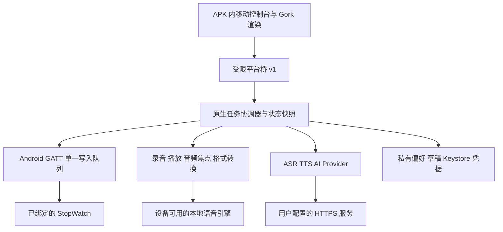

# Gork Android 手机端 PRD

文档版本：v1.0.0
编制日期：2026-09-27
状态：方向已授权实施；当前源码为 v0.1.4-dev 调试候选，手机/Watch 真机及云请求门禁待验。
目标设备：用户所称 vivo200 手机；闪念项目历史记录为 vivo X200 Pro、V2405/V2405A，具体型号、Android / OriginOS / WebView 版本须在实施前实机复核。
执行配套：[25-Gork-Android手机端开发任务书-v1.0.0-【codex】.md](25-Gork-Android手机端开发任务书-v1.0.0-【codex】.md)

## 1. 结论与需求口径

可以实现为类似“大尾巴闪念”的独立 Android APK：桌面图标启动，手机内运行 Gork 角色与控制页面，由手机蓝牙直接控制 StopWatch。无需把 Windows Electron、Python venv 或整套桌面程序搬进手机。

本稿采用的推荐假设是“电脑关机，手机仍可操控 Watch”。这是规划默认值，尚不是用户已确认的实施范围。“不依赖电脑”也不等于“所有功能离线”：本地角色、BLE 表情、文字、短音可离线；AI 回答、云端识别/合成需要网络及用户自己的服务配置。系统离线中文语音是否可用须实机探测。

“和闪念一样”解释为同样可安装、可独立启动、保留设置、可覆盖升级的手机应用，不解释为合并进闪念、不共享其数据库或凭据，也不复用其飞书中继。闪念参考聊天为 `codex://threads/019e9b26-b477-7a23-acc3-f5274317ddcf`，本轮已读取聊天及本地项目 README、构建脚本和上级 AGENTS。

规划轮仅交付 PRD、任务书和项目状态索引。2026-09-27 用户已要求开始执行；当前 Android 工程与调试候选见 `03-Src/gork-android/` 和 `04-output/android/v0.1.0/`。手机安装、切换绑定、重启桌面服务或修改固件仍未执行。

## 2. 经源码核对的现状

| 当前组成 | 已核对事实 | 手机端处理 |
|---|---|---|
| 控制台 | 源码 v0.15.0-dev；Mantine 构建生成静态页面，JavaScript 控制器访问 `/api` | 复用设计语言、角色资源和可分离的纯逻辑；增加 Android 平台适配，不能只复制 HTML |
| 后端 | Python FastAPI + Bleak；Host / Origin 只允许 loopback；语音与造价地址也有本机约束 | 手机直连模式重写原生能力；未来远控另加认证网关，不直接开放 8766 |
| 桌面小人 | Electron 窗口、IPC、置顶、缩放、独立气泡 | 手机内角色复用；跨 App 悬浮另用 Android 窗口能力 |
| Watch | 记录基线为固件 v0.9.1-dev；三个 BLE 服务由同一连接使用 | 按现有协议实现 Android GATT 客户端，首版不改固件 |
| 绑定模型 | `ble_control.cpp` 保存一个 boundPeer，认证后核对身份，拒绝第二条连接 | 手机不能仅靠电脑断开就取得权限；首版须明确切换绑定 |
| 语音 | 项目内 Python 服务 v0.3.2，有本地模型与云适配，单活会话 | 不复制 Windows 环境；手机使用原生录放音及独立 Provider |
| 闪念 | Java/XML Android App；脚本基线 min SDK 23、target SDK 35；有签名、旧 APK 归档和升级流程 | 借鉴交付与验证办法；Gork 使用自己的包名、签名及构建工程 |

上表是源码及文档核对，不是本轮手机或 Watch 实测；现有运行后端版本仍应在实施时通过 `/api/health` 核实。

## 3. 路线选择

| 路线 | 电脑关机可用 | Watch 所在位置 | 代价与限制 | 决定 |
|---|---|---|---|---|
| 手机网页访问电脑 | 否 | 电脑附近 | 需改访问边界、HTTPS/认证；手机浏览器录音和后台能力另验 | 不作为推荐产品终点 |
| APK + 电脑网关 | 否 | 电脑附近 | 保留 Python 能力，但仍依赖电脑；须处理控制权与会话冲突 | 后续可选增强 |
| APK + 手机原生 BLE | 基础控制可以 | 手机附近 | 原生蓝牙、音频、生命周期需实现；需处理单绑定限制 | 推荐主线 |

推荐技术组合：Kotlin 原生宿主 + AndroidX WebView + 打包在 APK 内的 Gork 页面/角色资产。Android 负责 BLE、权限、音频、凭据和生命周期，WebView 负责移动端布局和角色绘制。使用标准 Gradle Wrapper 工程；纯 Java/XML 也可实现，但不为“像闪念”逐页重写现有角色渲染。

暂拟 minSdk 31，以 Android 12+ 权限模型服务这台个人手机；compileSdk / targetSdk 在 T00 根据已装 SDK、所选 AndroidX/构建插件及目标系统锁定，不能直接照抄闪念旧 target 35。首版 arm64-v8a；确需原生 Opus 编码器时再按 T06 引入锁定版本的 NDK/库，不在规划阶段安装。

## 4. 版本和功能范围

Android 独立记版本，不改变现有电脑端 v0.15.0-dev 和 Watch v0.9.1-dev。下列版本均为计划，尚无 APK。

| 能力 | v0.1.0 基础控制 | v0.2.0 语音与 AI | v0.3.0 伴侣体验 |
|---|---|---|---|
| 本地 Gork、形象/配色、主题、偏好 | 必须 | 保留 | 保留 |
| 手机直接扫描、配对、连接 Watch | 必须 | 保留 | 保留 |
| 表情、文字气泡、清屏、短音、音量、停止 | 必须 | 保留 | 保留 |
| 手机本地文字输入、输出目标选择 | 必须 | 保留 | 保留 |
| 手机中文朗读 | 探测引擎，支持时可用；失败明确提示 | 通过一个实际中文 TTS Provider 验收 | 保留 |
| 按住说话、转写、AI 回答 | 不作为 v0.1 验收项 | 必须，允许显式配置的云 Provider | 保留 |
| TTS → Opus/PCM → Watch 朗读 | 协议方案冻结 | 必须，真机完整句听验 | 保留 |
| 有通知的后台 BLE 与息屏恢复 | 基础可恢复，不承诺常驻 | 30 分钟链路/息屏验收 | 长时耗电及稳定性优化 |
| 跨 App 悬浮小人及气泡 | 无 | 无 | 用户可选，拒绝权限仍可用主 App |
| Watch 麦克风录音 | 无 | 仅列实验需求 | Audio test 实验，非日常语音入口 |
| 造价助手、电脑远控 | 显示后续边界，不做假在线入口 | 不作为首版必需 | 独立网关计划，另行立项 |
| 电脑/手机无须清绑定交替控制 | 不支持 | 不支持 | 另开固件多绑定方案，非本稿自动授权 |

首个完整手机语音控制闭环的交付目标是 v0.2.0；v0.1.0 是可以单独安装验收的中间版本，不能将其称为桌面功能全量迁移。

明确不做：iOS、公开商店发布、账号体系、多人同时控制、全天候监听、实时双向 BLE 通话、后台自动上传、手机离线运行整套造价数据库、自动迁入闪念数据。

## 5. 手机交互设计

采用“顶部紧凑角色区 + 中间当前内容 + 底部四标签”，四页为对话、角色、Watch、设置。日志从状态摘要进入独立详情，避免把所有模块塞进首页。延续 Mantine / 经典主题；不照搬桌面 4:6 左右分栏。

- **对话**：唯一输入框；原文/AI 回答来源；手机朗读、角色显示（手机 / Watch / 两端）、Watch 朗读分别选择。默认只在手机显示，Watch 输出需连接和明确选择；再次发送沿用已保存选择但不能自动重放旧任务。
- **角色**：10 种现有手机端形象、配色、恢复；23 条来源动画；触摸点击预览、单独按钮发送，不能依赖鼠标悬停。Watch 固定 Gork，happy-work 按设备能力单独标注。
- **Watch**：扫描、目标选择、连接/断开、绑定说明、短音和音量、停止、固件/能力信息。尚无读取协议的数据不伪造，例如电池百分比不能仅因界面有位置就显示模拟值。
- **设置**：主题、语音输入/输出 Provider、上传许可、凭据录入/移除、后台连接、缓存清理、关于/版本。系统引擎不可用时展示具体原因。
- **状态**：分开显示手机本地、Watch 链路、云服务；“设备已配对”不等于“控制已就绪”；“已发送”不等于“已播完”。
- **全局停止**：对话页固定按钮，活跃任务期间通知中提供停止；立即停止手机播放/录音并废弃本轮，再取消网络与 Watch 任务。

验收覆盖 360、390、412 dp 宽度、横竖屏、系统字体 100%/130%、键盘展开、安全区和返回键。主要触控目标至少 48 dp。键盘打开后压缩/折叠角色区，输入框、发送和停止仍可见；内部内容滚动，不造成整页无尽滚动。离开可见角色页或息屏暂停无用动画。

## 6. 架构和模块边界

原生协调器拥有 session / turn / generation 以及 BLE connection epoch。WebView 重建、旋转或后台恢复只获取快照，不自行重发历史指令；应用进程死亡后清除未完成副作用任务，保留草稿与偏好。每个任务具有超时、取消和明确终态。

建议的桥契约：`capabilities.get`、`state.get`、`device.scan/connect/disconnect`、`character.play/showText/clear`、`sound.play/volume/stop`、`speech.recognize/synthesize`、`answer.complete`、`task.cancel`；实现时在 T01 固化 JSON Schema 和错误码。调用统一携带 `requestId`、`generation`、`method`、`params`，事件携带 `eventSeq` 和任务状态。桥上的 requestId 不代表旧 BLE 表情协议获得了 request_id。

现有 `static/app.js` 直接访问 `/api` 并调用 `window.gorkDesktop`，不能原封不动放入 APK。抽取显式的平台接口；桌面默认仍用原 HTTP/Electron 适配，手机使用 NativeBridge。只共享纯渲染、数据和可验证的纯逻辑，不在手机模拟整个 Python Web 服务，不劫持全局 fetch。

WebView 使用 WebViewAssetLoader 从受控 HTTPS 形式的本地 origin 读取 APK assets；原生桥按精确 origin 和主 frame 校验，方法白名单、大小限制、JSON 校验、超时和取消必须齐全。外部链接交给系统浏览器，远端 HTML 不能进入带桥的页面。模型回复按文本渲染；禁止任意 JavaScript 执行、任意文件读取和任意地址代理。WebView 不保存密钥，不加载 CDN。参考 Android 官方[本地内容加载](https://developer.android.com/develop/ui/views/layout/webapps/load-local-content)与[原生桥安全要求](https://developer.android.com/privacy-and-security/risks/insecure-webview-native-bridges)。

规划目录（实施前不创建空工程）：`03-Src/gork-android/` 存宿主和构建配置；共享角色继续以 `03-Src/stopwatch-voice-companion/static/` 的已声明资源及 `03-Src/avatar-library/` 为源；脚本按白名单生成 Android assets 并验证一致性，禁止手改分发副本。APK、报告存 `04-output/android/vX.Y.Z/`；构建缓存与临时音频进 `Codex-Temp/` 或手机应用私有缓存。

## 7. BLE、绑定与交接

### 7.1 单绑定是首要约束

当前固件只保存一个控制端身份；即使 Windows 已断开，手机通常仍会在认证阶段被拒绝。首版默认“手机为当前控制端”，通过设备设置中的显式清绑定和 Pair 操作迁移，不以关闭加密或放开陌生设备绕过。

首次迁移流程：说明对电脑连接的影响 → 用户确认现场换绑 → 电脑手动断开并停止自动重连 → Watch 本地清绑定、打开 Pair → 手机内选择目标并接受系统可能弹出的配对确认 → 完成服务发现/订阅 → 返回 Watch 机器人画面 → 执行最小表情、文字测试。自动化不能静默点击系统配对许可。

恢复电脑流程：手机显式断开并关闭重连 → Watch 本地清绑定/Pair → 用现有电脑恢复流程重建匹配绑定 → 验证服务发现及最小命令。若旧系统绑定残留，提示用户处理旧配对，不能调用未公开 Android removeBond 接口作为正常路径。清绑定并非刷固件，但会改变已有使用状态，须在实机任务开始前取得当次允许。

若用户要求电脑和手机日常无缝切换，需另开固件设计：多个可信绑定身份、明确新增/移除操作、同一时刻一个 owner、忙时拒绝、释放控制、陌生端拒绝及恢复路径。该目标不能靠 APK 单方面实现。

### 7.2 连接与命令

- 使用公开 Android BLE API；扫描服务 UUID 与设备名称作为候选，不把历史 MAC 当唯一可信证据。身份最终由设备加密绑定及服务验证确定。
- 一个 BluetoothGatt 对象管理表情、短音、音频服务；服务发现、CCCD 订阅、MTU 与控制写入按回调串行完成。`READY` 必须晚于权限、绑定、服务发现、订阅和必要握手成功。
- 原表情/清屏回执没有事务编号；串行写入、匹配回执、超时断连、epoch 丢弃旧通知，不把读到的旧状态当成功。`ERR:BUSY` 明确提示退出设备设置页。
- 文字沿用 F0/F1/F2/F3，单包 ≤20 字节，整条 ≤72 UTF-8 字节/24 个固件可支持字符。针对中文、多字节、emoji 做校验；不支持字符提示替换，不能截断 UTF-8。
- 自动重连只恢复连接与能力，不重放文字/语音；手动断开立即终止扫描和重试。建议前台退避 2/5/10/30 秒，后台只在系统允许且用户开启保持连接时运行。
- 蓝牙关闭、权限撤销、系统强停、链路丢失均退出就绪态；停止返回“本地已停止、Watch 停止未确认”时不能伪报全端成功。

## 8. 音频、AI 与联网策略

### 8.1 Provider 策略

| 能力 | 首选实现 | 降级及验收边界 |
|---|---|---|
| 文本输入 | 手机键盘/粘贴 | 永久保留，无网络可用 |
| 按住说话 | 原生录音 + 选定 ASR；探测是否可用设备端识别 | 系统识别可能联网，不可自动标为离线；不可用保留文字输入 |
| 手机朗读 | 探测已装中文 TextToSpeech 引擎、可用音色与网络属性 | 未安装或无中文时明确提示；v0.2 必须验证至少一个可用 Provider |
| Watch 朗读 | 得到完整音频 → 转 PCM16 单声道 → 协商 Opus/PCM → BLE | 仅能在手机扬声器 speak 的引擎不足以支持 Watch；须验证文件/PCM 输出 |
| AI 回答 | 原生 HTTPS 客户端调用用户配置的文字模型 | 无配置时只跟读，不构造假回答；默认不提供工具调用或业务写入 |

云 ASR/TTS Provider 优先参考现有语音服务实际供应商协议，但独立实现移动适配和取消；Windows 环境变量中的 Key 不进入 APK。个人用户在手机上自行录入凭据，Keystore 保护本地加密存储、排除系统备份、日志脱敏；长效服务端秘密若不适合放手机，改为后续认证代理，不能声称 APK 可隐藏内置 Key。

离线语音是能力探测结果，非 vivo 系统默认保证。Android 官方说明系统 [SpeechRecognizer 可能将音频传到服务器](https://developer.android.com/reference/android/speech/SpeechRecognizer)；[TextToSpeech.synthesizeToFile](https://developer.android.com/reference/android/speech/tts/TextToSpeech) 是异步合成，须等完成回调再读文件，音色、格式和中文支持依引擎实测。离线大模型/本地 ONNX ASR/TTS 若需要，单列模型体积、内存、速度、许可和电量测评。

### 8.2 Watch 音频协议

必须以 `tools/stopwatch_audio.py`、`tools/stopwatch_opus.py` 与固件 `audio_probe.*` 为权威导出测试向量；不得将普通 Ogg/Opus 文件直接当 BLE payload。

- 当前 PCM 输入：16-bit、单声道、16 kHz 或 24 kHz；每段 0.1–10 秒，最大 480000 PCM 字节。编码数据及解码采样数均校验，禁止静默截尾。
- HELLO 能力协商后才发送 BEGIN_OPUS；不支持则退回 PCM。包长按 MTU 与协议上限 244 字节取较小值，不能假设 Android 请求的 MTU 就是最终值。
- 应用层最多 3 包在途不代表并发调用 3 次 Android GATT API：底层仍须遵循回调序列；窗口只针对尚未收到设备 ACK 的音频包。
- 进度仅按设备确认字节数；包括格式、已确认/总字节、实际阶段。超过 10 秒提示缩短，自动断句分段属于后续增强，首版不假装读完全文。
- 同轮顺序：音频全部确认 → COMMIT 成功 → 对应文字气泡 → PLAY → 等待终态。在同一设备任务锁内完成，后台表情不得插入覆盖。失败和取消不提前显示未播文字。
- 原固件已有语音增益和设备音量，手机不再叠加未经测量的固定倍数增益。转换、限幅及响度须用完整句分档听验。
- 手机播放响应音频焦点、来电/耳机变化；首版录音仅前台显式按键触发，进入后台停止录音。Watch 录音仍保留 Audio test、半双工和实验门禁。

### 8.3 权限与网络

首次使用某能力才申请相应权限；拒绝麦克风不影响文字控制，拒绝蓝牙不影响手机角色，拒绝悬浮不影响主 App。Android 12+ 蓝牙需要 SCAN / CONNECT 的运行时处理；不为 BLE 无故索取通讯录或文件全盘权限。依据[蓝牙权限文档](https://developer.android.com/develop/connectivity/bluetooth/bt-permissions)实施，`neverForLocation` 仅在符合实际用途且扫描测试通过时采用。

“允许上传录音、允许上传合成文字、允许上传回答文字”分开记录，允许随时撤销并阻断在途结果输出。当前桌面按用户既有要求默认三项许可勾选；Android 新安装在首次选云服务时明示数据去向并应用用户选择，不静默迁移桌面授权。重连不恢复已撤销许可，也不因打开 App 自动录音或上传。

后台 BLE 使用合规 `connectedDevice` 前台服务及可见状态通知；通知授权拒绝时保留前台模式并明确后台体验限制，不宣称系统已允许无限常驻。后台麦克风不属于首版。Android 对[后台 BLE](https://developer.android.com/develop/connectivity/bluetooth/ble/background)和[前台服务类型](https://developer.android.com/develop/background-work/services/fgs/service-types)有启动/权限条件；OriginOS 实际息屏行为必须实测，不能承诺“永不被杀”。

## 9. 后续增强的独立边界

跨 App 悬浮小人可用 TYPE_APPLICATION_OVERLAY 及用户授予的悬浮权限实现；需要单独评估支撑服务、通知和后台启动资格，不能用 BLE 服务类型为纯悬浮行为兜底。拖动、收起、关闭、气泡位置、安全区和其他 App 交互均验收；锁屏默认隐藏内容。官方入口见 [Settings 悬浮权限](https://developer.android.com/reference/android/provider/Settings#ACTION_MANAGE_OVERLAY_PERMISSION)。系统桌面 Widget 不等同于可任意跨 App 悬浮。

电脑远控/造价助手若开发：新建受认证的 HTTPS 网关、配对令牌、过期/撤销、请求限流与控制租约；网关访问本机原服务，保留现有 8766/8765/8000 的 loopback 默认。不把 CORS 放开当认证，不直接在公网暴露本机管理接口。手机直连模式与电脑代理模式互斥，发送中不能自动改路由；语音单活会话不得被手机默默接管。该方案涉及新的服务运行边界，另写接口设计后执行。

## 10. 验收及发布

验收用例和任务依赖以任务书为准。每项只允许 PASS / FAIL / BLOCKED / NOT_RUN，自动化与真机分开。

- v0.1：电脑停止连接，手机离线冷启动、角色、权限、加密连接、表情、短气泡、短音、音量、停止、断连恢复、保存偏好及同签名覆盖升级通过。
- v0.2：手机录音/转写、AI、手机朗读、Watch Opus/PCM 路径、全文/长度限制、COMMIT 时序、撤销许可、取消迟到结果、30 分钟后台/息屏测试通过；用户完成完整句听验。
- v0.3：悬浮权限拒绝/撤销、跨 App 拖动关闭、锁屏隐私、长稳和耗电测量通过；双端交替绑定不计入该版本，除非另获固件任务授权。

性能是待测目标：冷启动主要可交互界面 ≤3 秒；连接就绪后表情回执在 20 次测试中 p95 ≤1 秒；BLE 保持连接 30 分钟无应用崩溃，已就绪链路无故掉线须记录；主动离开覆盖区再返回 10 次中至少 9 次在 30 秒内恢复就绪。测试控制系统状态、距离和省电策略，失败不得靠删除样本达标。

Watch 音频用同一完整 5–6 秒 WAV 对照 PCM 与 Opus，各 5 次，分别记录连接、合成、传输和播放耗时；Opus 传输中位数目标 ≤同次 PCM 的 50%，这是验收目标而非手机性能承诺。现有 Windows 3.66 秒记录只是参考，不能直接当 Android 指标已达到。最低可用回退 PCM 也须真实可闻，不能只验 `played`。

发布包必须附版本名/versionCode、构建与签名信息、源码状态、第三方来源、安装升级说明、绑定切换/恢复说明、验证矩阵与已知限制。重建前归档上一 APK；不得用卸载重装代替数据保留升级。发布签名密钥由用户控制且不入仓库；若降级不能安全保留新 schema，说明限制，不伪称无损回滚。

## 11. 风险与待确认项

| 项目 | 已知情况/默认决策 | 关闭时点 |
|---|---|---|
| 是否要求电脑关机可用 | 本稿按“是”规划，待用户确认 | 开发启动前 |
| 手机型号/系统 | 历史 V2405A，未检查当前手机 | T00 |
| 是否接受首轮切换绑定 | 未获授权，须展示恢复流程后现场决定 | G1 实机连接前 |
| 中文离线 ASR/TTS | 不假设 OriginOS 自带引擎满足要求 | T05 能力探测 |
| 云服务与凭据 | 用户录入、分项许可；尚未配置或调用 | G2 实际云测试前 |
| 多设备交替和悬浮优先级 | 规划后续；若必须首版则重新排期 | G0 |
| 原生 Opus 编码 | 格式、依赖版本及构建链须验证 | T06 |
| 桌面回归 | 平台接口抽取可能影响既有 UI | 每次共享代码变化后 |

## 12. 事实来源与阅读入口

本地路径以 StopWatch 项目根目录为基准，所有版本均为 2026-09-27 查阅快照。

- `README.md`、`AGENTS.md`、PRD 21/23：产品、版本与 UI 边界。
- `03-Src/stopwatch-voice-companion/companion/app.py`：Host/Origin、本机地址及 HTTP 接口。
- `03-Src/stopwatch-voice-companion/static/app.js`：HTTP 与 Electron 依赖。
- `03-Src/stopwatch-grok-avatar/src/ble_control.cpp`：单绑定、单连接、认证顺序及拒绝行为。
- `03-Src/stopwatch-grok-avatar/src/ble_control.h`：表情服务 UUID、包长、Pair 窗口。
- `tools/stopwatch_audio.py`、`tools/stopwatch_opus.py`、`03-Src/stopwatch-grok-avatar/src/audio_probe.cpp`：音频格式、分包、窗口、时序与能力协商。
- `03-Src/voice-service/README.md`、`03-Src/stopwatch-voice-companion/companion/answer.py`：语音模块与回答配置边界。
- `D:\Codex-Temp\260606-android-dev\DabaweiFlashNote\README.md`、`tools\build-apk.ps1` 及上级 `AGENTS.md`：闪念构建、版本、APK 归档和 Android 参考规则，只读参考。
- 本文各节 Android Developers 官方链接：平台能力与限制；设计判断与性能目标由本项目提出，不代表官方保证。
